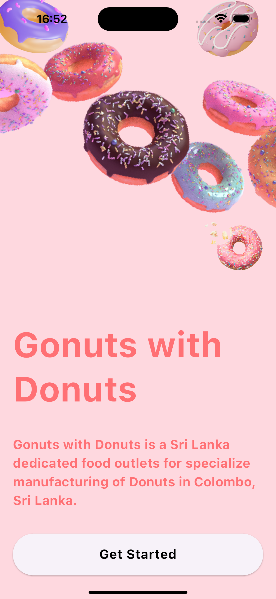
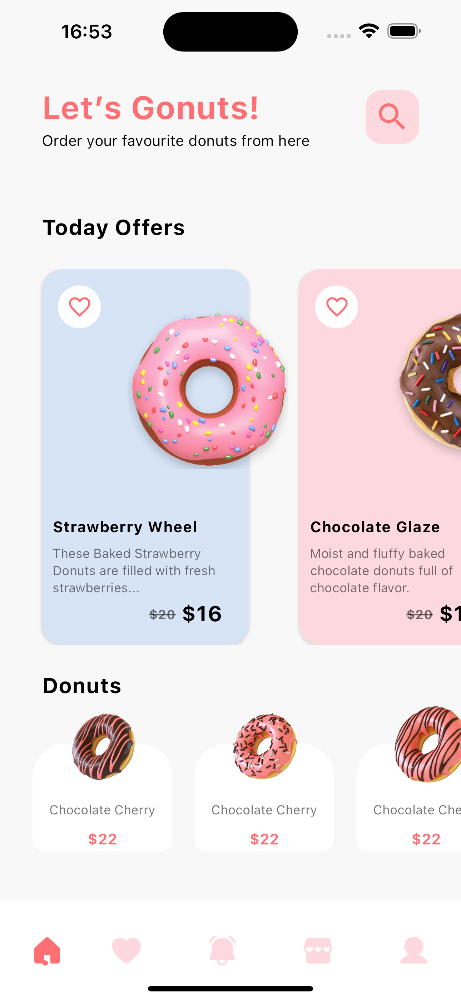

# Donuts App

The Donuts app is a user-friendly application with smooth animations for the counter and favorite (like) functionality.

## Features

- User-friendly interface
- Smooth animations for counter and favorite actions
- Integration with popular Flutter packages for enhanced functionality

## Screenshots

## Packages Used

- **dot_navigation_bar:** ^1.0.2
  - A package for a customizable bottom navigation bar.

- **flutter_phosphor_icons:** ^0.0.1+6
  - Provides a set of beautiful icons for your Flutter applications.

- **flutter_animate:** ^4.5.0
  - Allows you to easily add stunning animations to your Flutter app.

- **animate_do:** ^3.3.3
  - A package for adding various entrance and exit animations.

## Connect with Me

- LinkedIn: [Your LinkedIn Account](https://www.linkedin.com/in/amirmahdi-nourkazemi-04613023a/)
- LinkTree: [Your LinkTree Account](https://linktr.ee/Amirmahdi_Nourkazemi)

## Getting Started

1. Clone the repository
2. Run `flutter pub get` to install dependencies
3. Open the project in your preferred Flutter development environment
4. Run the app on your preferred emulator or device

## Contributing

Contributions are welcome! If you find any issues or have suggestions, please open an issue or create a pull request.

## License

This project is licensed under the [Your License Name] - see the [LICENSE.md](LICENSE.md) file for details.

